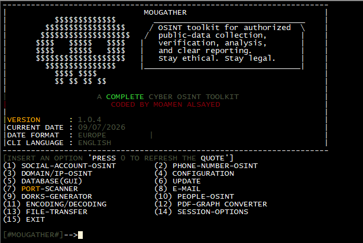

<div align="center">
  

  <h1>MouGather</h1>

  <p>
    Cyber OSINT toolkit for authorized public-data collection,
    verification, analysis, and reporting.
  </p>
</div>

---

## Screenshot



---

## Features

- Social account OSINT
- Phone number OSINT
- Domain/IP OSINT
- Port scanner
- Dorks generator
- People OSINT
- Encoding and decoding tools
- File transfer
- Session and report tools

---

## Installation

```bash
git clone https://github.com/shezbendo0o0o/MouGather.git
cd MouGather
sudo apt-get update
sudo chmod +x install.sh
sudo bash install.sh
```

---

## Run

```bash
mougather
```

Or:

```bash
python3 mougather.py
```

---

## Ethical Use

MouGather is intended only for educational, research, and authorized OSINT purposes.

Use it only on targets, systems, accounts, domains, or data that you own or have permission to investigate.

---

## License

GPL-3.0 License. See the `LICENSE` file.
